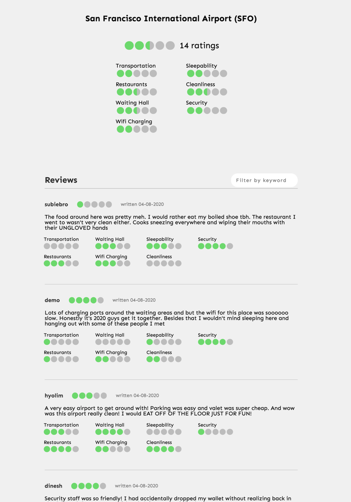
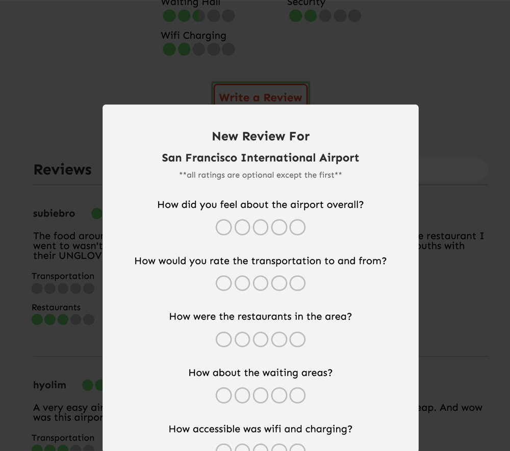

# [Airport Advisor](http://airport-advisor.herokuapp.com/)

## Background and Overview

Flying can be a very stressful experience.

Oftentimes, travelers may find it much easier if they have information on the services of the airport they are visiting before they travel. Airport Advisor allows travelers to get useful information from fellow travelers about the airports they are going to visit, as well as share their own experiences.

The site will feature easy searching and navigation so a user can view ratings on different categories. Users may also help others by reviewing airports as well.

## Functionality & MVP

- [ ] Search bar with autofill that allows you to search airport by name and airport IATA code
- [ ] Users can leave a review, along with ratings, and view others' reviews and ratings
- [ ] Filter for reviews based on keywords

## Technologies & Technical Challenges

### Backend: Node, Express, MongoDB

For the backend, we will be using a Node server that utilizes the Express framework for routing and mongoDB for storing data.

### Frontend: React, Redux, Trip Advisor API

For the frontend, we will be using React and Redux as our main frameworks and will be utilizing the Trip Advisor API for displaying various data for information we will not be storing in our backend.

### Technical challenges we will face include:

Parsing the large amount of airport data that we will have stored on the backend

#### Splash Page

#### Search Bar / Autocomplete

Search bar
 

Result for a particular airport

#### Creating and Editing Review

Creating a review

Posting the review

Edit and delete buttons

Filtering in the reviews

## Group Members & Work Breakdown

- Dilan Balci (Backend engineer)
- Hyo Lim Jeong (Backend engineer)
- Terry Chow (Frontend engineer)
- Nathan Mendes (Frontend engineer)

Used git feature branch workflow technique for collaboration.

